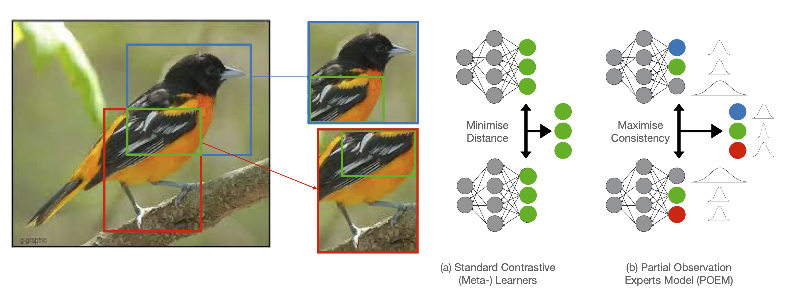
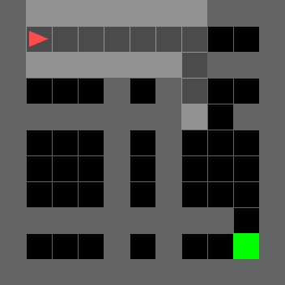
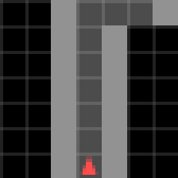
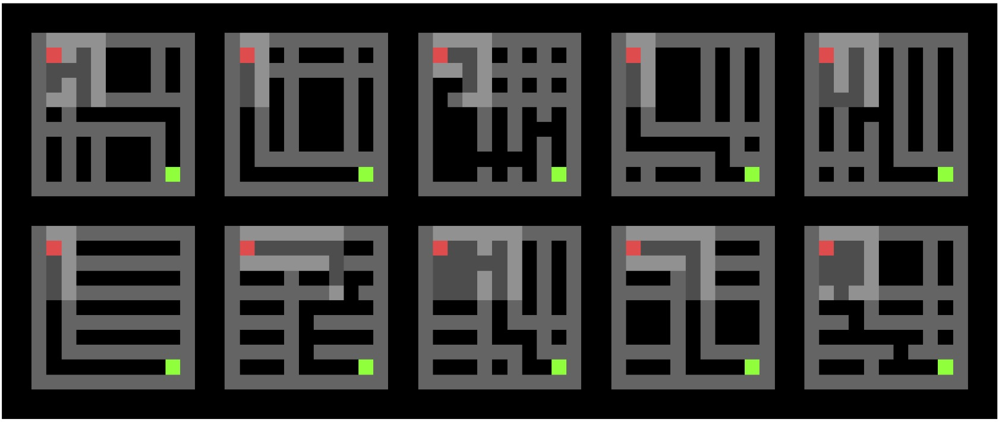
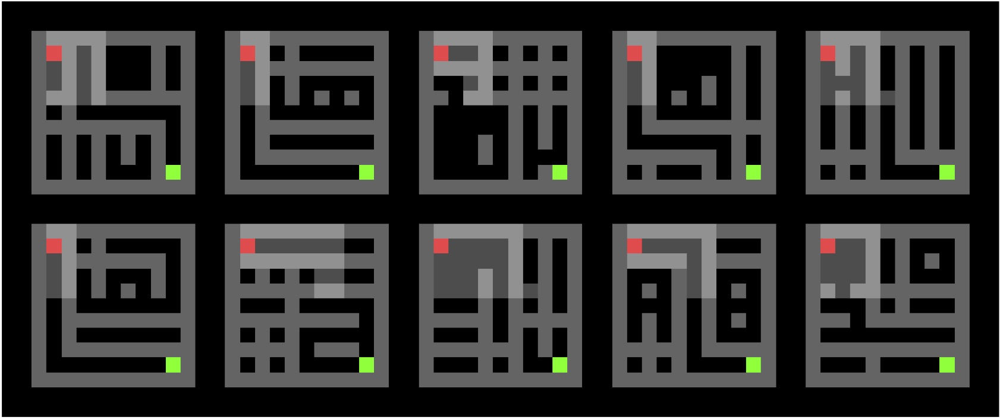

# POEM: Partial Observation Experts Modelling
This repository contains the official PyTorch implementation of POEM (Partial Observation Experts Modelling), a contrastive/meta-learning approach for learning representations from partial observations. This approach was introduced in our paper:

[Contrastive Meta-Learning for Partially Observable Few-Shot Learning](https://arxiv.org/abs/2301.13136) (accepted for publication at ICLR 2023)


## Installation

Clone the repository (including submodules for use for learning representations of RL agent environments). Create the specified conda environment and install the gym-minigrid package, as below:

```
git clone --recurse-submodules https://github.com/AdamJelley/POEM
conda env create --file environment.yml
conda activate POEM
pip install -e ./gym-minigrid
```

Note: If you have already cloned the project and forgot `--recurse-submodules`, to add the submodules required to run the RL agent environment experiments you can run:
```
git submodule update --init
```

## Usage
### Toy Few-Shot Learning Experiments
Example: Training POEM on partial observations of MiniImageNet:
```
python -m FSL.main --dataset miniimagenet --learner POEM --cropping --use_coordinates --num_crops 5 --n_way 20 --n_support 1 --n_query 5
```
To list full configuration options run:
```
python -m FSL.main --help
```
Toy experiments use on the [torchmeta](https://github.com/tristandeleu/pytorch-meta) package, so the required MiniImageNet and Omniglot datasets can be downloaded automatically. However, torchmeta limits the torchvision version (to torchvision<0.11.0 and >=0.5.0, as in e.g. [this issue](https://github.com/tristandeleu/pytorch-meta/issues/161)). If you don't intend to run the toy experiments you can upgrade the the PyTorch/Torchvision packages from those specified in the environment file.

### Minigrid Agent Environment Experiments
 

Example: Training POEM on the 11x11, 5 room [simple crossing environment](https://minigrid.farama.org/environments/minigrid/CrossingEnv/):
```
python -m RL.main --env MiniGrid-SimpleCrossingS11N5-v0 --trained_agent CrossingS11N5_A2C_fullgrid_navigation --exploratory_agent CrossingS11N5_A2C_fullgrid_navigation_state_bonus --learner POEM --use_location --use_direction --num_train_tasks=5000
```
Full configuration options can be listed with
```
python -m RL.main --help
```
A pretrained agent (to generate optimal trajectories) and an exploratory agent (to generate queries for training) are both available for the example above in the bundled `minigrid_rl_starter` package. For other environment variants these agents will need to be trained independently. Note that the bundled `gym-minigrid` package uses an environment wrapper to only allow navigation actions to simplify the action space for these agents.

Once POEM has been trained to synthesise partial observations into unified environment representations, a decoder can be trained on these representations to generate environment reconstructions from the trajectories of agent-centric observations in new environments.

Example: Training a decoder to generate environment reconstructions from a trained POEM model (using the wanbd run from the training above):
```
python -m RL.main_decoder --env MiniGrid-SimpleCrossingS11N5-v0 --agent CrossingS11N5_A2C_fullgrid_navigation --learner POEM --use_location --use_direction --log_frequency 10 --num_episodes=5000 --decode_grid --model_run_path <wandb-username>/<wandb-project>/<wandb-run-id>
```
 

Environments (left) and their reconstructions from agent observations using POEM (right).

### Meta-Dataset Benchmarking
The full Meta-Dataset benchmarking reported in the paper was carried out using the [GATE (Generalisation After Transfer Evaluation)](https://github.com/BayesWatch/POEM-Bench) framework, to ensure strict evaluation procedures and using state-of-the-art backbones (as specified) for fair comparisons with baselines. Our benchmarking codebase is available in the repository [POEM-Bench](https://github.com/BayesWatch/POEM-Bench).

Final results on Partially-Observable Meta-Dataset (as introduced in our paper) with ResNet-18 backbones:

| **Test Source** | **Finetune**   | **ProtoNet** | **MAML**   | **POEM**       |
|:---------------:|:--------------:|:------------:|:----------:|:--------------:|
| **Aircraft**    | 46.5+/-0.6     | 48.5+/-1.0   | 37.5+/-0.3 | **55.3+/-0.7** |
| **Birds**       | 62.6+/-0.7     | 67.4+/-1.2   | 52.5+/-0.6 | **71.1+/-0.1** |
| **Flowers**     | 48.5+/-0.4     | 46.4+/-0.7   | 33.5+/-0.3 | **49.2+/-1.5** |
| **Fungi**       | 61.0+/-0.2     | 61.4+/-0.4   | 46.1+/-0.4 | **64.8+/-0.3** |
| **Omniglot**    | 71.3+/-0.1     | 87.8+/-0.1   | 47.4+/-1.0 | **89.2+/-0.7** |
| **Textures**    | **83.2+/-0.4** | 76.7+/-1.6   | 73.1+/-0.4 | 81.4+/-0.6     |

## Citation

```
@misc{jelley2023contrastive,
      title={Contrastive Meta-Learning for Partially Observable Few-Shot Learning}, 
      author={Adam Jelley and Amos Storkey and Antreas Antoniou and Sam Devlin},
      year={2023},
      eprint={2301.13136},
      archivePrefix={arXiv},
      primaryClass={cs.LG}
}
```
